# Enterprise Authentication Attack Detection with Splunk

Enterprise SOC detection lab demonstrating authentication attack detection across Linux, Windows, and VPN infrastructure using Splunk SIEM.

---

# Project Overview

This project focuses on detecting authentication-based attacks and correlating events across multiple systems using Splunk SIEM.

### Attacks Simulated

• SSH brute force (Linux)  
• Password spray (Linux accounts)  
• Windows RDP brute force  
• OpenVPN authentication attack  

All attack activity is ingested and analyzed in Splunk SIEM.

---

# Lab Architecture

This lab replicates a **real-world enterprise SOC environment** with:

- Network segmentation  
- Centralized logging  
- Multi-source telemetry  
- SIEM-based detection  

---

## Network Zones

- **WAN (Internet)** → External attacker entry point  
- **Firewall Layer (pfSense)** → Traffic control + VPN gateway  
- **DMZ Zone** → Public-facing service (OpenVPN)  
- **Internal LAN** → Endpoints (Windows, Linux)  
- **SOC Zone** → Security monitoring (Splunk SIEM)

---

## Architecture Diagram
```text
                          Internet (WAN)
                                │
                                │
                     ┌────────────────────┐
                     │   pfSense Firewall │
                     │   192.168.1.1      │
                     │  (VPN Gateway)     │
                     └─────────┬──────────┘
                               │
         ┌─────────────────────┼─────────────────────┐
         │                     │                     │
      DMZ Zone           Internal LAN             SOC Zone
         │                     │                     │
  ┌──────────────┐     ┌──────────────┐      ┌──────────────┐
  │ OpenVPN      │     │ Windows 10   │      │ Splunk SIEM  │
  │ Service      │     │ 192.168.1.20 │      │ 192.168.1.50 │
  │ (External)   │     │ (RDP Target) │      │ Log Analysis │
  └──────────────┘     └──────────────┘      └──────┬───────┘
                                                    │
                                              Log Ingestion
                                                    │
         ┌─────────────────────────────┼─────────────────────────────┐
         │                             │                             │
   Linux Logs                   Windows Logs               Firewall / VPN Logs
 (/var/log/auth.log)          (Event ID 4625/4624)        (pfSense / OpenVPN)

                                                    │
                                                    │
                                      ┌─────────────▼─────────────┐
                                      │   Kali Linux Attacker     │
                                      │   192.168.1.60            │
                                      │  (Simulated Threat Actor) │
                                      └───────────────────────────┘
```

##  Data Flow (Detection Pipeline)

1️) Attacker (Kali Linux) launches attacks:

* SSH brute force
* RDP brute force
* VPN authentication attempts
* Password spraying

2️) Target systems generate logs:

* Linux → `/var/log/auth.log`
* Windows → Event ID 4625 / 4624
* pfSense/OpenVPN → Authentication logs

3️) Logs are forwarded to Splunk SIEM:

* Centralized ingestion
* Field extraction & normalization

4️) Splunk performs detection:

* SPL detection queries
* Cross-source correlation
* Alert generation

5️) SOC investigation:

* Identify attacker IP
* Analyze targeted accounts
* Correlate events across systems
* Validate attack behavior

---

## Security Controls Implemented

* Network segmentation (pfSense firewall)
* VPN authentication monitoring
* Endpoint log collection
* Centralized SIEM visibility

---

## SOC Perspective

This lab demonstrates key SOC capabilities:

* Multi-source log correlation
* Authentication attack detection
* Realistic attacker simulation
* End-to-end detection workflow
* SIEM-driven investigation

---

# 1) SSH Brute Force Attack (Linux)

This scenario simulates an SSH brute force attack from an external attacker and demonstrates detection, alerting, and investigation using Splunk SIEM.

---

## Attack Simulation

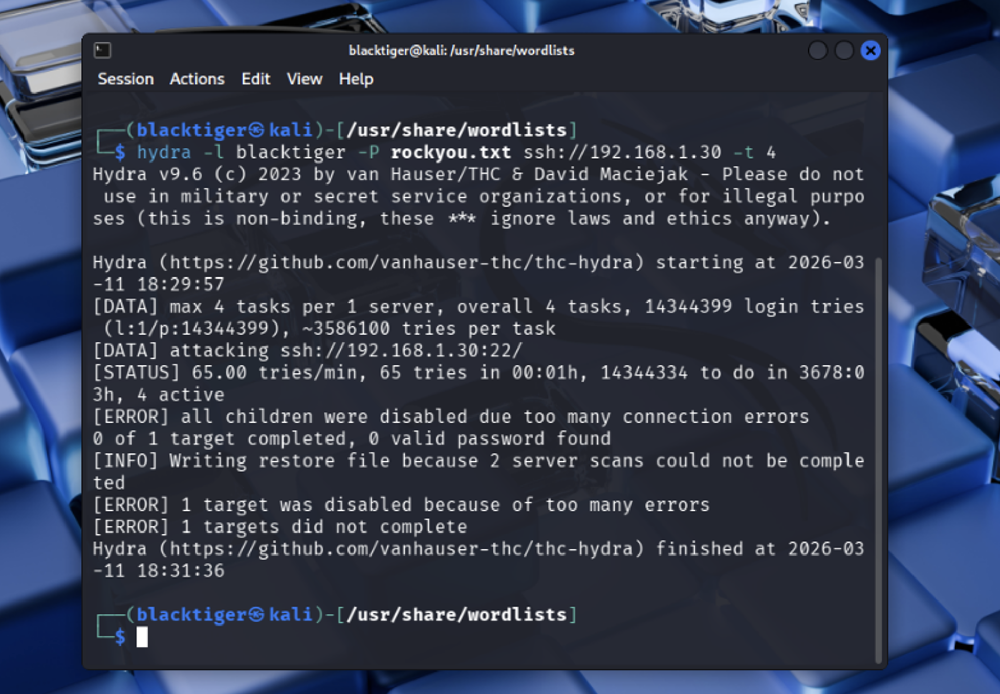

---

## Detection in Splunk

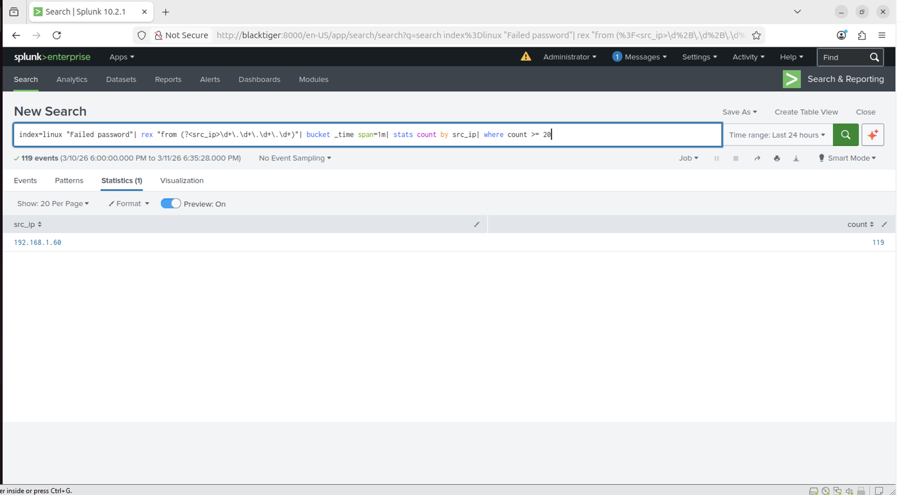

---

## Alert Triggered

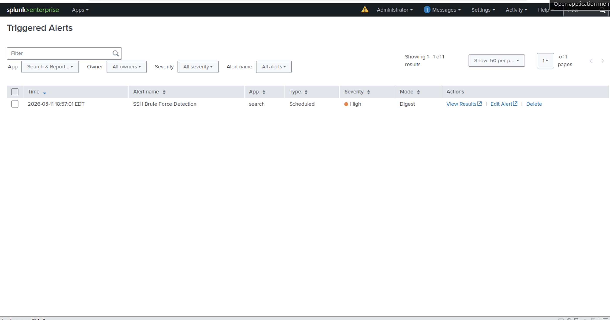

---

## SOC Investigation

**Attacker IP:** 192.168.1.60


---

## Detection Logic (Splunk SPL)

### Baseline Detection (Implemented in Lab)

```spl
index=linux "Failed password"
| rex "from (?<src_ip>\d+\.\d+\.\d+\.\d+)"
| bucket _time span=1m
| stats count by src_ip
| where count >= 20
```

This detection identifies a high number of failed login attempts from a single source IP.

---

### Advanced Detection (SOC-Level Improvement)

```spl
index=linux "Failed password"
| rex "from (?<src_ip>\d+\.\d+\.\d+\.\d+)"
| bucket _time span=1m
| stats count by _time, src_ip
| where count >= 20
```

This enhanced detection introduces time-based analysis to identify spikes of authentication failures within short intervals, which is a strong indicator of automated brute force activity.

This reflects real-world SOC practices where detections are refined using time-based thresholds to reduce false positives and improve attack visibility.

---

# 2) Password Spray Attack (Linux)

This scenario simulates a password spray attack where a single attacker attempts authentication across multiple user accounts using a common password.

---

## Attack Simulation

The attacker used a list of usernames to attempt authentication using the same password.

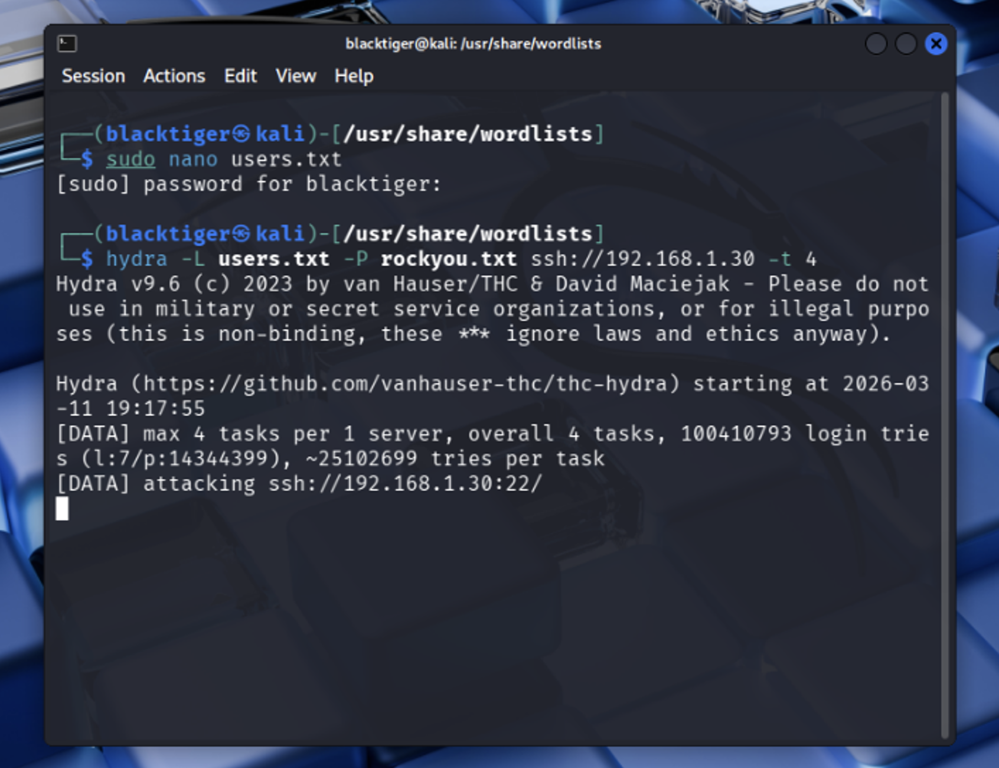

---

## Detection in Splunk

Detection focuses on identifying a single source IP targeting multiple distinct user accounts.

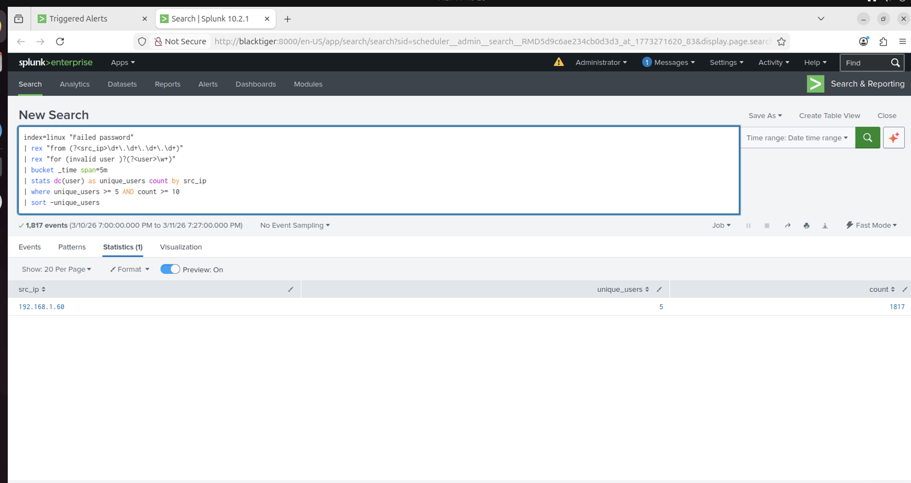

---

## Alert Triggered

An alert is generated when multiple accounts are targeted from the same source IP.

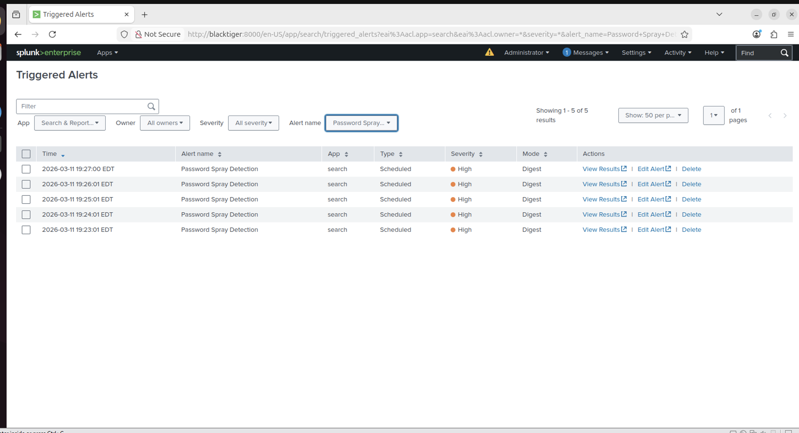

---

## SOC Investigation

The investigation confirms multiple distinct user accounts targeted from attacker IP:

**192.168.1.60**

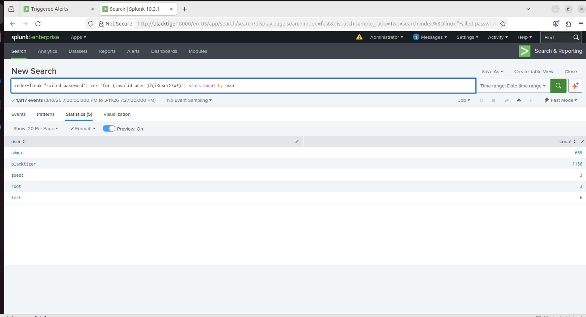

---

## Detection Logic (Splunk SPL)

```spl
index=linux "Failed password"
| rex "from (?<src_ip>\d+\.\d+\.\d+\.\d+)"
| rex "for (invalid user )?(?<user>\w+)"
| bucket _time span=5m
| stats dc(user) as unique_users count by src_ip
| where unique_users >= 5 AND count >= 10
```

This detection identifies password spray attacks by detecting a single source IP attempting authentication across multiple distinct user accounts within a short time window.

---

## MITRE ATT&CK Mapping

| Tactic            | Technique         | ID        |
| ----------------- | ----------------- | --------- |
| Credential Access | Password Spraying | T1110.003 |

---

## Outcome

* Detected multiple account targeting behavior
* Identified attacker IP
* Triggered alert based on abnormal authentication pattern
* Simulated real-world credential-based attack scenario


---

## 3) Windows RDP Brute Force Attack

This scenario simulates a brute force attack against a Windows system using RDP and demonstrates detection and investigation using Splunk SIEM.

---

## Attack Simulation

The attacker machine scanned the target for open RDP port **3389** and attempted multiple login attempts using different credentials.

```bash
nmap -p 3389 192.168.1.20
xfreerdp /v:192.168.1.20 /u:Administrator
```

A custom password list was used to simulate brute force attempts.

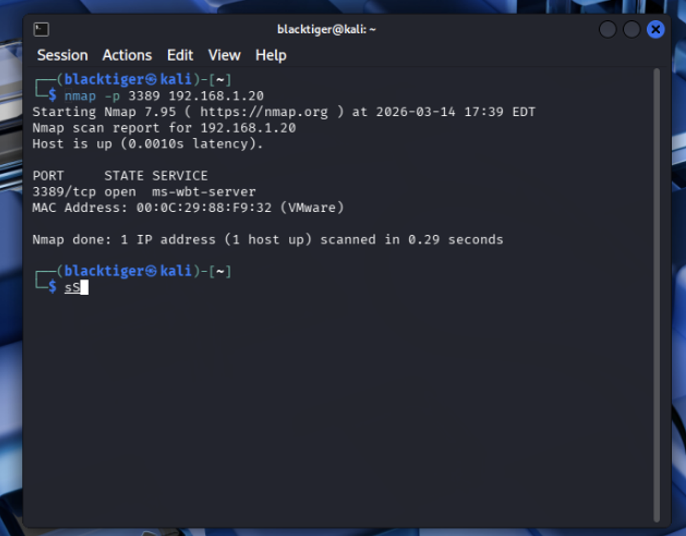

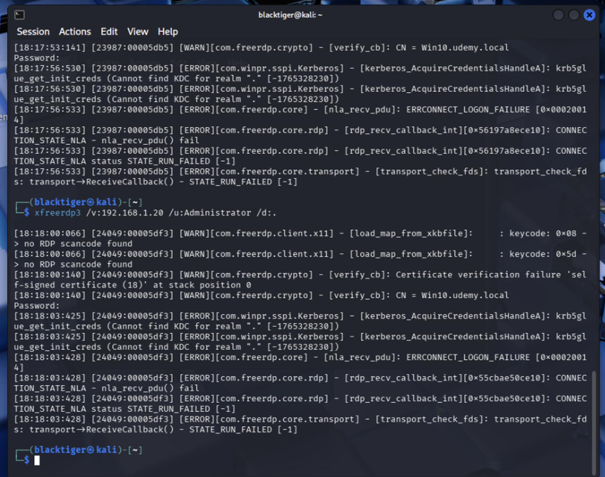

---

## Detection in Splunk

Failed RDP login attempts were identified using Windows Security Event Logs:

* **EventCode 4625 → Failed login**
* Source IP: attacker machine

```spl
index=windows (EventCode=4625 OR EventCode=4624)
| stats count by Source_Network_Address EventCode
```

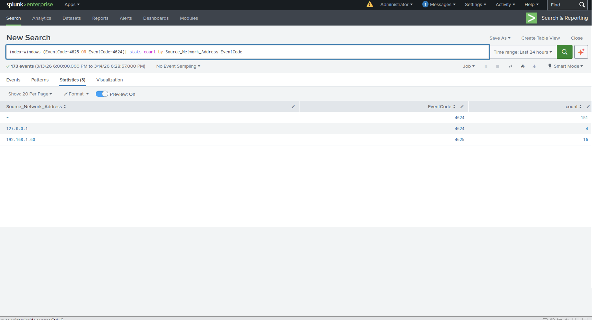

---

## Alert Triggered

A Splunk alert was configured to trigger when failed login attempts exceeded a threshold.

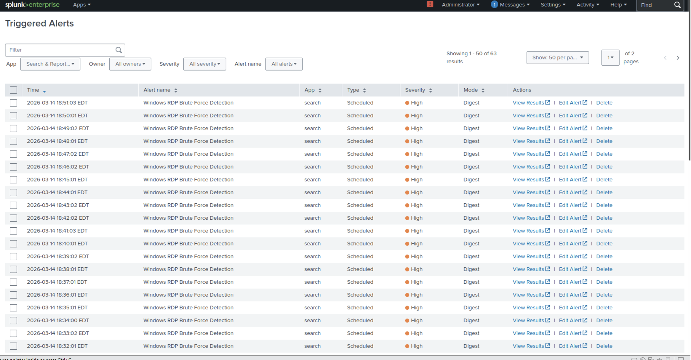

---

## SOC Investigation

Further analysis shows:

* Attacker IP: **192.168.1.60 (Kali Linux)**
* Targeted accounts: Administrator and multiple users
* Logon Type: **3 (Network Logon)**

```spl
index=windows EventCode=4625
| eval src_ip=coalesce(Source_Network_Address, Client_Address)
| search src_ip!="-" src_ip!="127.0.0.1"
| stats count by src_ip Account_Name Workstation_Name Logon_Type
| sort -count
```

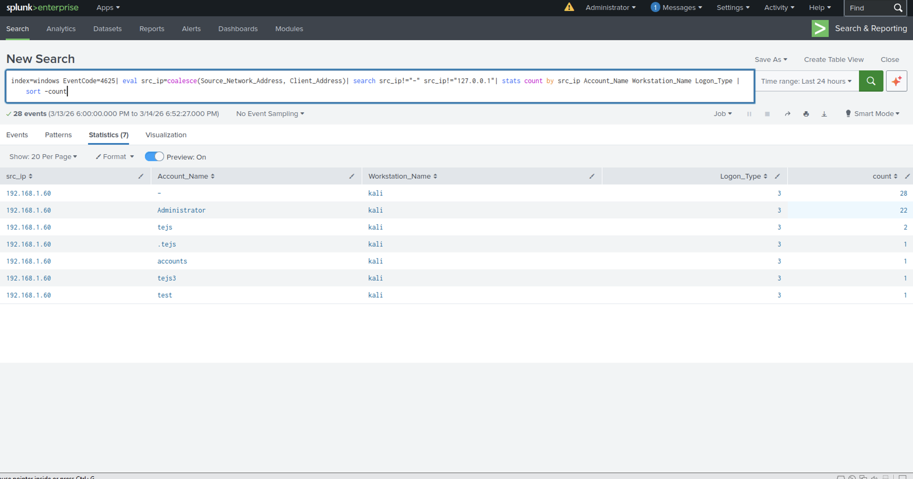

---

## Advanced Detection & Account Correlation

```spl
index=windows EventCode=4625
| eval src_ip=coalesce(Source_Network_Address, Client_Address)
| search src_ip!="-" src_ip!="127.0.0.1"
| stats count values(Account_Name) as targeted_accounts by src_ip Workstation_Name
| sort -count
```
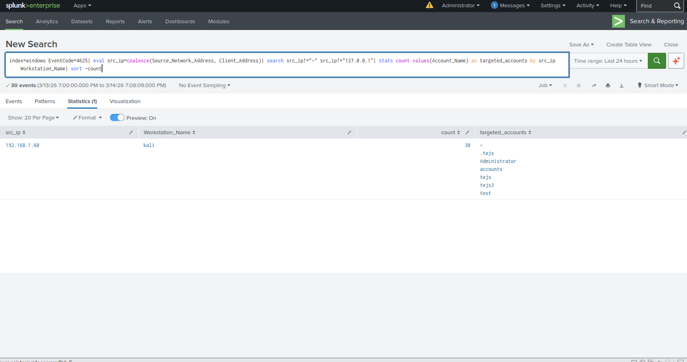

---


## MITRE ATT&CK Mapping

| Tactic              | Technique                     | ID        |
|---------------------|-------------------------------|----------|
| Credential Access   | Brute Force                  | T1110    |
| Initial Access      | Valid Accounts               | T1078    |
| Lateral Movement    | Remote Services (RDP)        | T1021.001 |

---

## SOC Insight

This attack demonstrates a typical brute force scenario where:

* An attacker attempts multiple failed logins (Event ID 4625)
* Eventually gains access (Event ID 4624)
* Uses RDP as an entry point into the system

This is a common real-world attack pattern used by threat actors to gain initial access or move laterally within a network.

---

# 4) OpenVPN Brute Force Attack

This scenario simulates a brute force attack against an OpenVPN service and demonstrates detection and investigation using Splunk SIEM.

---

## Attack Simulation

The attacker machine attempted multiple authentication attempts against the VPN service using invalid credentials.

```bash
sudo openvpn ~/Desktop/pfSense-UDP4-1194-vpnuser-config.ovpn
````

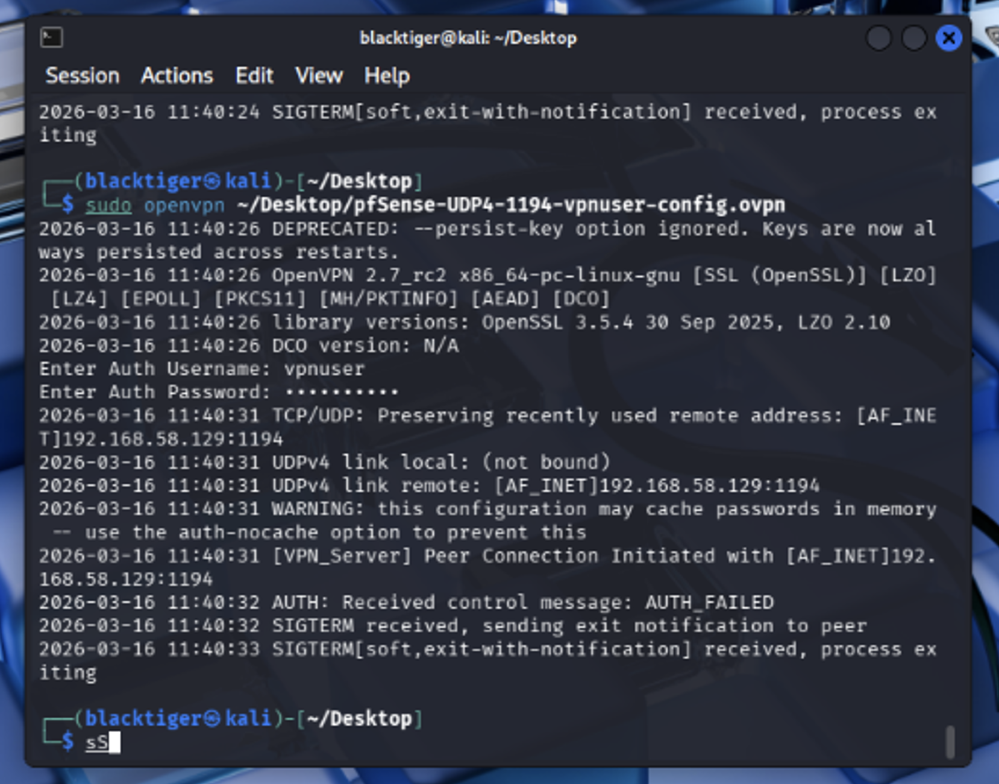

---

## Detection in Splunk

Failed VPN authentication attempts were identified using pfSense OpenVPN logs.

* **AUTH_FAILED → Failed login**
* Source IP: attacker machine

```spl
index=pfsense "AUTH_FAILED"
| stats count by src_ip
| sort -count
```

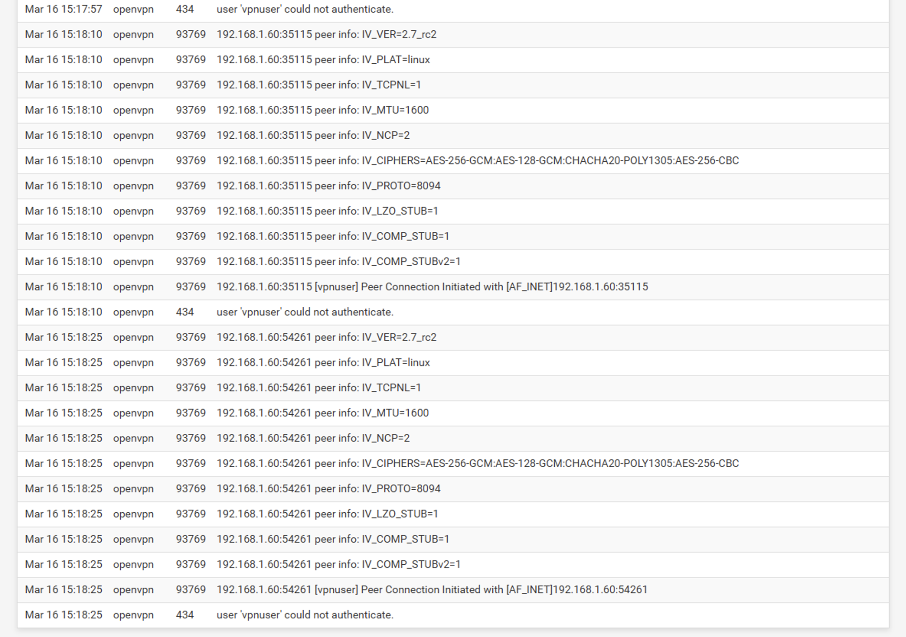

---

## Alert Triggered

A detection rule was created to identify repeated authentication failures from a single source.

```spl
index=pfsense "AUTH_FAILED"
| rex field=_raw "(?<src_ip>\d+\.\d+\.\d+\.\d+):\d+"
| stats count by src_ip
| where count > 5
```

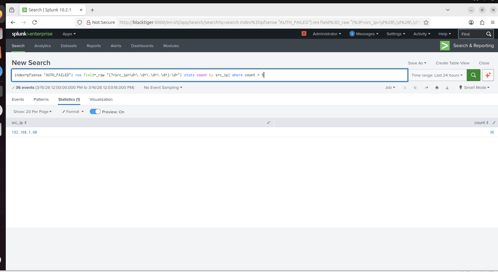

---

## SOC Investigation

Further analysis confirms brute force activity:

* Attacker IP: **192.168.1.60 (Kali Linux)**
* Target account: **vpnuser**
* Multiple failed authentication attempts observed

```spl
index=pfsense "connected"
| rex "user '(?<user>[^']+)'"
| rex "address (?<src_ip>\d+\.\d+\.\d+\.\d+)"
| table _time user src_ip
```

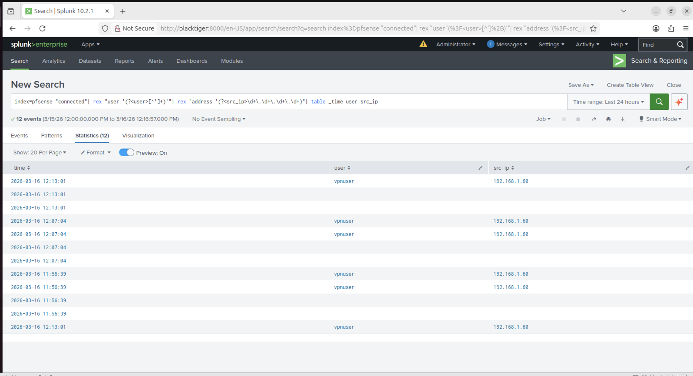

---

## Advanced Detection & Correlation

This detection correlates failed and successful authentication attempts from the same source IP.

```spl
index=pfsense ("AUTH_FAILED" OR "connected")
| rex field=_raw "(?<src_ip>\d+\.\d+\.\d+\.\d+)"
| stats 
    count(eval(searchmatch("AUTH_FAILED"))) as failures
    count(eval(searchmatch("connected"))) as success
    by src_ip
| where failures >= 5 AND success >= 1
```

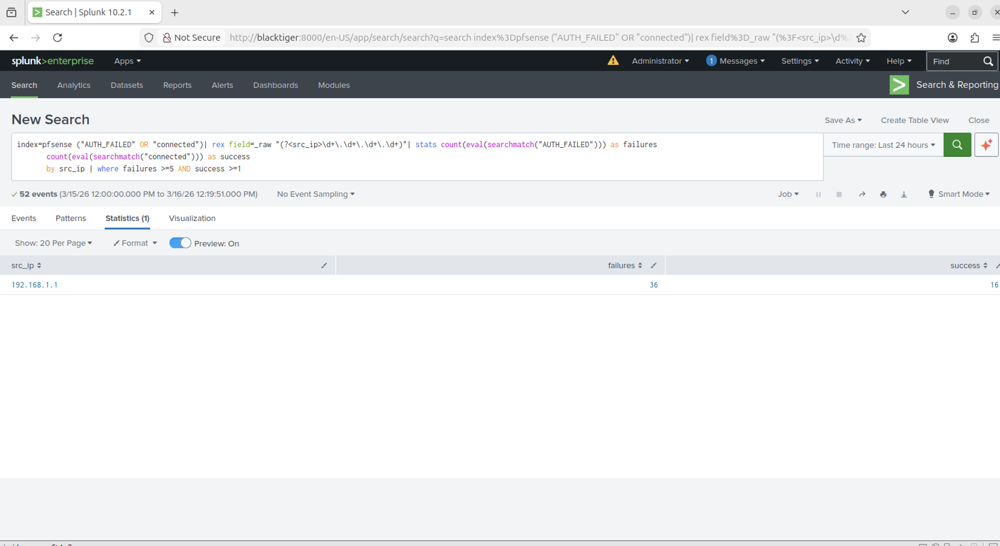

---

## MITRE ATT&CK Mapping

| Tactic            | Technique         | ID        |
| ----------------- | ----------------- | --------- |
| Credential Access | Brute Force       | T1110     |
| Credential Access | Password Spraying | T1110.003 |

---

## Outcome

* Detected repeated VPN authentication failures
* Identified attacker IP address
* Correlated failed and successful login attempts
* Simulated real-world VPN attack scenario
* Demonstrated SOC-level detection and investigation workflow

---

## Cross-Platform SOC Insight

Across all scenarios (SSH, RDP, VPN), the same attacker IP **192.168.1.60** was observed:

- Performing brute force attacks on Linux (SSH)
- Targeting multiple accounts (password spray)
- Attempting RDP authentication on Windows
- Attacking VPN authentication

This demonstrates a **real-world attack pattern**, where a threat actor targets multiple entry points within an environment.

Such activity can be detected through **cross-source correlation in SIEM**, a key capability of modern SOC operations.

---
